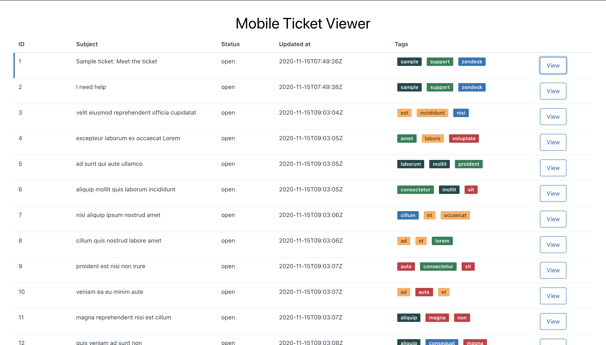
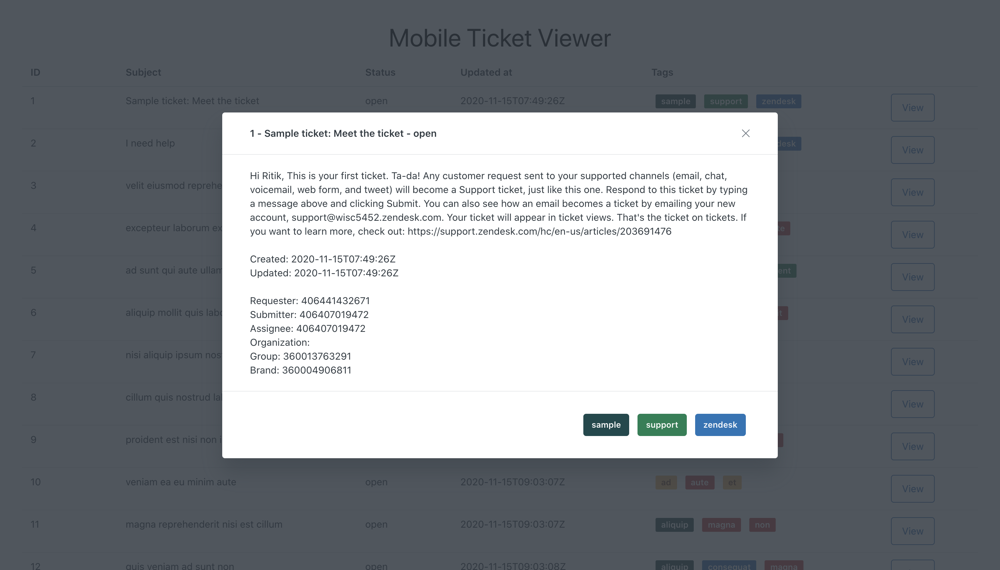
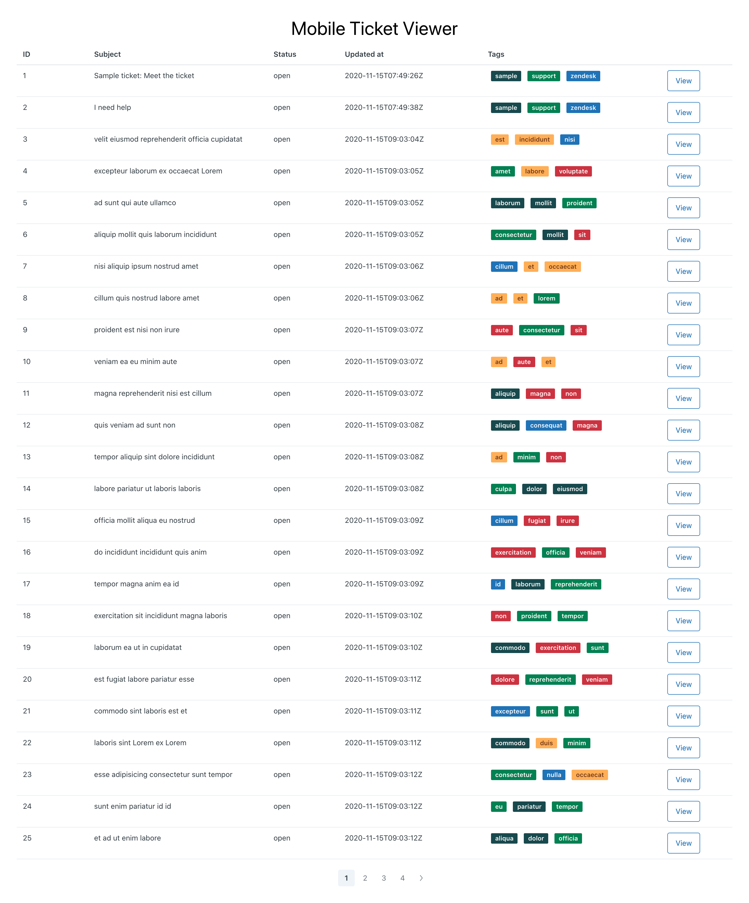

# Zendesk Ticket Viewer

A web app to view a list of Zendesk tickets and ticket details using the Zendesk API.

Technologies/Frameworks used:
1. React.js
2. Zendesk Garden UI Library
3. Node.js
4. Express

## Screenshots

Ticket List


Ticket Details View


Ticket List Full Page


## Installation
1. Clone the repository
```
git clone https://github.com/rtkg12/zendesk-ticket-viewer
cd zendesk-ticket-viewer
```

2. Install dependencies
`yarn install`

## Usage

1. Modify the .env file in `server` with your Zendesk subdomain, email and password.
2. Run the app using `yarn start` in the root directory of the repo.
3. Navigate to `http://localhost:3000` to use the app
